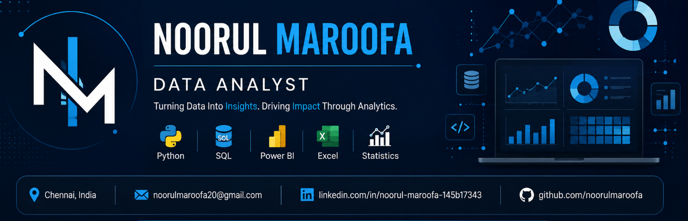

  

<h1 align="center">Welcome To My GitHub</h1>

<h3 align="center">
Data Analyst • Python • SQL • Power BI • AI & Data Science Student
</h3>

Turning Data into Insights • Building End-to-End Analytics Solutions

---

# About Me

- B.Tech Artificial Intelligence & Data Science Student

- Passionate about Data Analytics & Business Intelligence

- Skilled in Python, SQL, Power BI and Data Visualization

- Building end-to-end analytics pipelines from raw data to interactive dashboards

- Exploring AI-powered analytics, automation and cloud technologies.

📍 Chennai, India

---

# Tech Stack

## Programming

---

## Data Analytics

- Python   - SQL Server   - Power BI   - DAX   - Power Query
- Pandas   - NumPy     - Matplotlib    - Streamlit   - Microsoft Excel

---

# GitHub Streak

---

# Contribution Graph

---

# 💼 Featured Projects

## Amazon Sales Intelligence Dashboard

End-to-End Business Intelligence Solution

### Tech Stack

- Python
- SQL Server
- Power BI
- DAX
- Power Query

### Highlights

- Customer Segmentation
- Revenue Analysis
- KPI Dashboard
- Star Schema
- Business Insights

---

## CyberScope AI-powered Analytics Platform

AI-based Cybersecurity Analytics Dashboard

### Tech Stack

- Python
- APIs
- SQL
- Power BI
- AI Report Generation

### Highlights

- Threat Intelligence
- Live API Integration
- AI-generated Reports
- Security Analytics

---

## LinkedIn Workforce Intelligence Dashboard

Job Market Analytics Platform

### Highlights

- Skill Demand Analysis
- Hiring Trends
- Salary Insights
- Company Analytics

---

## Ultimate Fast Food Showdown

Business Intelligence Dashboard

### Highlights

- Sales Analysis
- Nutrition Analytics
- Customer Ratings
- Interactive Dashboard

---

# Certifications

- Google Analytics Certification
- AWS Fundamentals
- NPTEL Python
- IBM Excel Basics
- Smart India Hackathon 2025 – Cleared Round 2

---

# Career Objective

To build scalable data-driven solutions that help organizations make better business decisions through analytics, visualization, with interactive dashboards .

---

# 📫 Connect With Me

---

---

⭐ Thank you for visiting my GitHub profile!

Let's connect and build impactful Data Analytics solutions together.

<!--
**noorulmaroofa/noorulmaroofa** is a ✨ _special_ ✨ repository because its `README.md` (this file) appears on your GitHub profile.

Here are some ideas to get you started:

- 🔭 I’m currently working on ...
- 🌱 I’m currently learning ...
- 👯 I’m looking to collaborate on ...
- 🤔 I’m looking for help with ...
- 💬 Ask me about ...
- 📫 How to reach me: ...
- 😄 Pronouns: ...
- ⚡ Fun fact: ...
-->
